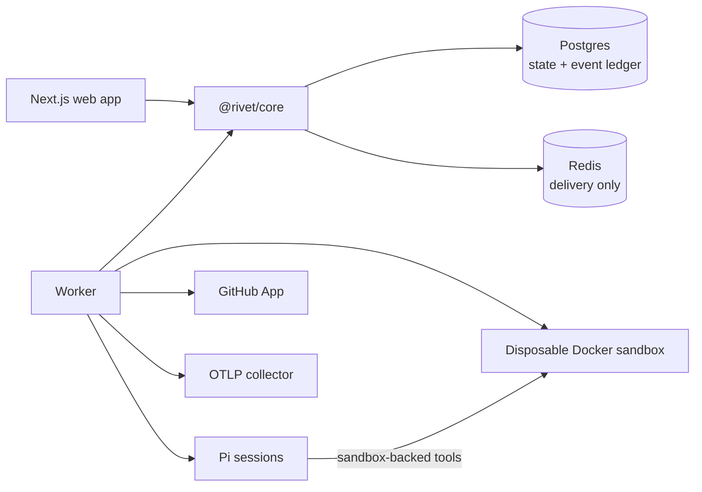

# Rivet

**An autonomous software engineering platform that turns a GitHub issue into a tested pull
request.**

Rivet plans a change, edits code in a disposable Docker sandbox, validates the result against the
repository's existing checks, sends the patch through an independent review, and publishes an
ordinary GitHub pull request. Postgres-backed leases, checkpoints, and an append-only event log keep
the run durable and observable when workers or browser connections fail.

[Watch a real issue-to-PR run on YouTube](https://youtu.be/X_b03iHhXzU) or read the accompanying
[engineering notes on X](https://x.com/hieuspringle/status/2091312854389719528).

## What Rivet includes

- **Sandboxed execution** - cloned repositories and agent tools run in disposable, resource-limited
  Docker containers. Model and control-plane credentials stay on the worker host.
- **Durable orchestration** - Postgres leases, heartbeats, retries, cumulative budgets, and
  checksum-verified Git patches let another worker resume interrupted jobs.
- **Structured planning and review** - a read-only planner produces the implementation plan, and an
  independent read-only reviewer can request bounded revision loops.
- **Deterministic validation** - targeted tests, full tests, typecheck, and lint are compared with
  pre-change baselines so new failures are distinguished from existing ones.
- **GitHub publication** - a GitHub App provides repository and issue selection, short-lived
  installation tokens, and idempotent branch, push, and pull request creation.
- **Live operations** - the Next.js interface streams the append-only timeline over SSE and renders
  plans, commands, diffs, validation reports, reviews, and publication results.
- **Observability and evaluation** - OpenTelemetry traces and metrics, correlated logs, benchmark
  cases, hidden-test grading, and replayable recorded runs are built in.

## Current scope

Rivet is open source and usable today as a **local, single-operator application**. It is not a
hosted, multi-tenant service. Its Docker sandbox is a useful local execution boundary, but it is not
a substitute for a hardened hostile-code runtime such as a microVM. Do not expose Rivet directly to
the public internet.

A real Docker worker requires local Postgres and Redis. Rivet refuses to start if a sandbox can
reach its configured control plane, so managed public endpoints such as Neon and Upstash cannot be
used for real sandboxed jobs. See [Security](SECURITY.md) for the supported trust model and known
limitations.

## Architecture



The web app and worker share one framework-independent domain library. Postgres is authoritative;
Redis messages contain only job IDs and can be reconstructed. The coding harness and provider key
stay on the trusted worker host, while all repository reads, writes, and commands go through the
sandbox. Read [docs/architecture.md](docs/architecture.md) for the complete execution and recovery
model.

## Quick start

### Inspect, build, and test

You need Node.js 24 and pnpm 10.32.0. These commands require no database, Redis, or Docker:

```bash
git clone https://github.com/xuanhieu2611/Rivet.git
cd Rivet
corepack enable
pnpm install
pnpm test
pnpm build
```

### Run Rivet locally

A real coding run requires local Postgres, local Redis, Docker, and a model provider key.

1. Start Postgres and Redis on your machine and make sure `docker version` prints a Server section.
2. Copy `.env.example` to `.env.local`.
3. Set `DATABASE_URL`, `DATABASE_URL_UNPOOLED`, and `REDIS_URL` to the local services.
4. Set `RIVET_AGENT="pi"` and add `OPENROUTER_API_KEY`.
5. Apply the schema and start both deployables:

```bash
pnpm db:migrate
pnpm dev
```

Open <http://localhost:3000>. Without GitHub publication enabled, Rivet can run against a public
repository URL and finish with a validated diff. To select installations and publish pull requests,
follow the [GitHub App setup guide](docs/github-app-setup.md), then set `RIVET_GITHUB="app"`.

For UI development without a container or model call, set `RIVET_SANDBOX="off"` and
`RIVET_AGENT="off"`. These simulation modes are deliberately refused when `NODE_ENV=production`. The
committed [`.env.example`](.env.example) documents every option and default.

## Repository validation

Rivet infers `test`, `typecheck`, and `lint` commands from a repository's `package.json`. A
repository can override any check with a strict `rivet.json`:

```json
{
  "validation": {
    "test": {
      "argv": ["pnpm", "test"],
      "timeoutMs": 600000,
      "reporter": { "framework": "vitest", "outputArg": "--outputFile" }
    },
    "typecheck": { "argv": ["pnpm", "typecheck"] },
    "lint": { "argv": ["pnpm", "lint"] },
    "targeted": { "argv": ["pnpm", "vitest", "run"], "appendPaths": true }
  }
}
```

Commands are argv arrays, never shell strings. `reporter` supports Vitest and Jest. Omitted checks
fall back to inference, while a malformed configuration fails explicitly instead of being ignored.

## Common commands

| Command                   | Purpose                                                 |
| ------------------------- | ------------------------------------------------------- |
| `pnpm dev`                | Start the web app and worker                            |
| `pnpm test`               | Run database-free unit tests                            |
| `pnpm typecheck`          | Typecheck all workspaces                                |
| `pnpm lint`               | Lint all workspaces                                     |
| `pnpm build`              | Build without requiring infrastructure                  |
| `pnpm test:integration`   | Test workers with local Postgres and Redis              |
| `pnpm test:streaming`     | Test SSE behavior with local Postgres                   |
| `pnpm test:sandbox`       | Test real containers with local Postgres, Redis, Docker |
| `pnpm demo:pr`            | Run an issue-to-pull-request demo                       |
| `pnpm demo:recovery`      | Kill a worker and verify checkpoint recovery            |
| `pnpm demo:replay`        | Replay a captured run through production writers        |
| `pnpm demo:observability` | Run a traced job and print its Grafana trace URL        |
| `pnpm eval:build`         | Build lock-pinned benchmark repositories                |
| `pnpm eval:run`           | Run the configured evaluation matrix                    |

## Repository layout

```text
apps/web          Next.js control plane and live run interface
apps/worker       Worker process, demos, and infrastructure suites
packages/core     Domain logic, pipeline, state transitions, and ports
packages/agent    Pi coding-agent adapter
packages/database Drizzle schema, migrations, and Postgres client
packages/queue    BullMQ and Redis adapter
packages/sandbox  Docker sandbox adapter
packages/telemetry OpenTelemetry adapter
benchmarks        Lock-pinned evaluation cases and hidden tests
demo/replays      Redacted captured-run fixtures
docs              Architecture, security, operations, and experiments
```

## Documentation

- [Architecture](docs/architecture.md)
- [GitHub App setup](docs/github-app-setup.md)
- [Security policy and supported use](SECURITY.md)
- [Security review](docs/security-review.md)
- [Evaluation experiment](docs/experiments/reviewer-value.md)
- [Contributing](CONTRIBUTING.md)

## Contributing

Issues and focused pull requests are welcome. Read [CONTRIBUTING.md](CONTRIBUTING.md) for the local
checks and contribution expectations. Report vulnerabilities through
[GitHub private vulnerability reporting](https://github.com/xuanhieu2611/Rivet/security/advisories/new),
not a public issue.

## License

Rivet is available under the [MIT License](LICENSE).
