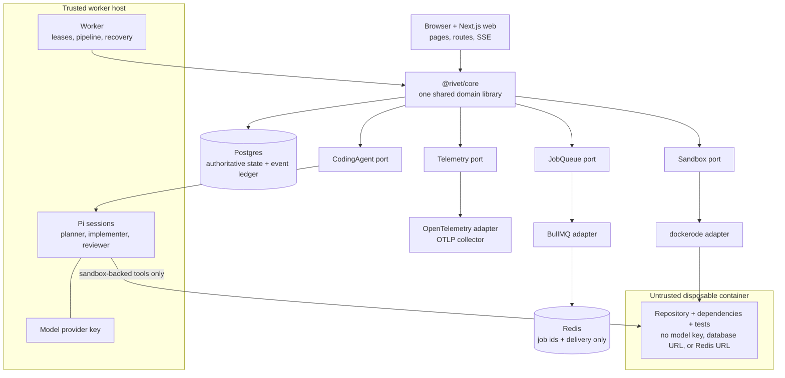

# Architecture

This document describes Rivet **as it exists today**, after Milestone 12's presentation pass. It
names the places where the current shape is a deliberate shortcut rather than the intended end
state. It is updated as each milestone lands rather than describing a system that does not exist
yet.

## The system, in one picture



The diagram carries four claims. The Next.js web process and long-lived worker call the same core
library directly, with no HTTP hop between either process and domain logic. Postgres owns every
durable fact, while Redis carries replaceable delivery messages. Queue, sandbox, coding-agent, and
telemetry integrations sit behind ports declared by core. Finally, Pi and its provider credential
stay on the trusted worker host, while repository code and every tool operation stay inside the
untrusted disposable container.

Milestone 0 built the web surface and durable job state. M1 through M3 added Redis delivery, worker
leases, Docker sandboxes, the append-only event log, and resumable SSE. M4 and M5 embedded Pi in the
trusted worker and completed the first autonomous coding loop. M6 made work recoverable through
checksum-verified Git patches, M7 added deterministic validation, and M8 added an independent
read-only reviewer with a bounded revision loop. M9 made GitHub publication idempotent through a
receipt ledger. M10 made ordinary jobs measurable through lock-pinned benchmarks and a second,
hidden-test grading container. M11 added OpenTelemetry, correlated logs, redaction, authentication,
rate limits, prompt fencing, and startup network probes. M12 changes the presentation and demo path
without changing the schema or the execution model.

## What exists today

| Component         | Where                | Responsibility                                                                           |
| ----------------- | -------------------- | ---------------------------------------------------------------------------------------- |
| Web UI            | `apps/web/app`       | Landing page, dashboard, job detail, evaluation pages, live timeline, logs and artifacts |
| HTTP API          | `apps/web/app/api`   | Session-guarded job, GitHub, benchmark, evaluation, artifact and event endpoints         |
| Worker            | `apps/worker`        | BullMQ consumer: claim, heartbeat, run the pipeline, publish, finalize, sweep            |
| Domain logic      | `packages/core`      | Jobs, transitions, artifacts, replay, evaluation, GitHub workflows, telemetry ports      |
| Queue adapter     | `packages/queue`     | BullMQ over Redis behind core's `JobQueue` port, plus an in-memory fake                  |
| Sandbox adapter   | `packages/sandbox`   | Dockerode behind core's `SandboxProvider` port, plus a scripted fake                     |
| Coding agent      | `packages/agent`     | Pi adapter, scripted fake, event mapper, and sandbox-backed tools                        |
| Telemetry adapter | `packages/telemetry` | OTLP/HTTP traces and metrics behind core's `Telemetry` port                              |
| Contracts         | `packages/contracts` | Zod schemas, job/event/command contracts, and the status enum                            |
| Data access       | `packages/database`  | Drizzle schema, generated migrations, and the `pg` pool                                  |
| Shared config     | `packages/config`    | The tsconfig and ESLint bases every workspace extends                                    |

Five tables. `jobs` holds the domain model: the task, repository and base branch, the full status
machine, budget ceilings, cumulative model spend, the immutable deadline, lease and retry state, the
dispatch generation, and the sandbox's resolved commit and environment fingerprint. `job_events` is
the append-only history behind the execution timeline. `job_commands` is the append-only command
ledger; transcripts live there rather than bloating every timeline read. `job_artifacts` is the
append-only store of a run's durable output - the diff, its stats, the implementation plan, the
implementation summary, the baseline and validation reports, and the review report - bounded and
read one fetch away for the same reason. `job_checkpoints` is the durable workflow cursor: one row
per safe boundary, carrying the phase to resume at and a complete compressed workspace patch.
Columns that only later milestones can fill remain nullable.

Five more tables arrived with M9 and M10 and sit deliberately to the side of that core.
`job_external_effects` is the append-only receipt ledger that makes publication idempotent, unique
on `(job_id, kind)`. `github_installations` is a **cache** of what GitHub says the App can act on.
`benchmark_cases` is the second cache in the system - a registry of the git-tracked benchmark
corpus, where editing a row changes nothing and editing the files and rebuilding does.
`evaluation_suites` and `evaluation_runs` hold the evaluation harness's results, and
`evaluation_runs.job_id` is the only foreign key into `jobs` anywhere in the schema. The direction
matters: a job stays a complete, self-contained record whether or not an evaluation ever referenced
it.

## The two deployables and the package they share

Rivet runs as two processes: `apps/web`, which is Next.js, and `apps/worker`, which is a long-lived
Node process under `tsx` with no build step. Both are thin. Everything that decides what happens to
a job lives in `packages/core`, and both processes call it directly as a library.

That is the resolution of Milestone 0's open question about extracting `apps/api`, and it is worth
being precise about why the answer changed. The M0 shortcut was that business logic lived in
`apps/web` with no service boundary, and the stated trigger for paying that cost was "when the
worker appears, two processes will need job state". The worker did appear - and the thing two
processes actually needed turned out to be **the same code**, not the same HTTP endpoint. A control
plane API would have meant the worker POSTing its own status transitions back to the web app, which
buys a network hop, a serialization format, an auth story and a second failure mode, in exchange for
a boundary that nothing yet needs to enforce. A shared package gives both processes the identical
compare-and-swap against the identical database, with no boundary to keep in sync.

What survives is the discipline that made either option available. `packages/core` has no `next/*`
import, so nothing in it is coupled to the web app; if an HTTP boundary is ever genuinely needed -
workers on untrusted infrastructure, third-party workers, a rate limit that has to live somewhere
central - `apps/api` becomes a thin HTTP skin over the same package rather than a rewrite. The
interim rule from M0 still stands: route handlers do parse, validate, delegate, respond, and nothing
else. Orchestration accumulating in a `route.ts` is the signal that something belongs in core.

Two more rules keep the package honest, and both are load-bearing rather than stylistic. It imports
no `bullmq`, `ioredis` or `dockerode`, because domain logic that depends on an adapter cannot claim
to be independent of it. Core declares `JobQueue` and `SandboxProvider` ports; `packages/queue` and
`packages/sandbox` are the only packages that know Redis and Docker exist. And core reads no
`process.env`: configuration arrives as arguments, which is what lets the pipeline run at `speed: 0`
in unit tests, in under a millisecond, with no fake timers.

## How a request flows

Two entry points, one path underneath. A page renders on the server and calls core directly - there
is no HTTP hop from a server component to the app's own route handler:

```text
browser
  │
  ├── page navigation ────▶ React server component  ┐
  │                          (apps/web/app/**)      │
  │                                                 ├──▶ @rivet/core ──▶ Drizzle ──▶ pg Pool ──▶ Neon
  └── fetch() from the ───▶ route handler           ┘   (business        (query
      form / cancel button   (app/api/jobs/**)          logic)           builder)
                             zod validate
```

The route handlers stay thin on purpose: parse the body, validate it with a schema from
`@rivet/contracts`, delegate to core, map the result to a status code. Validation errors come back
as `400` with field-level detail; anything unexpected is logged server-side and returned as a
generic `500`, never as a database error string.

`POST /api/jobs` is the one handler that does two things: it persists the row and then asks for a
run. The second half deliberately cannot fail the request - see the dual-write section below.
`POST /api/jobs/:id/cancel` returns three different codes because there are genuinely three
different outcomes: `200` when the job had not started and is now `cancelled`, `202` when a worker
holds it and the request has only been recorded, `409` when it already finished.
`GET /api/jobs/:id/events?after=<id>` is the timeline's incremental read. Content negotiation keeps
ordinary callers on the JSON cursor envelope while `Accept: text/event-stream` opens the live SSE
tailer. The durable event id is the reconnect cursor, so the transport changes without changing the
underlying contract.

Every page and route handler that touches the database sets `dynamic = "force-dynamic"`. That is
what lets `pnpm build` - and therefore CI - run with no database and no Redis at all: nothing is
prerendered, so nothing connects at build time.

## The queue

BullMQ on Redis, behind a port. `packages/core` declares the whole of what the domain needs from a
queue, which is three methods:

```ts
interface JobQueue {
  enqueueJobRun(
    jobId: string,
    dispatchGeneration: number,
    options?: EnqueueOptions,
  ): Promise<EnqueueResult>;
  removeJobRun(jobId: string, dispatchGeneration: number): Promise<boolean>;
  close(): Promise<void>;
}
```

`packages/queue` implements it twice: `BullJobQueue` for the real system, and `InMemoryJobQueue`,
which is an array, for tests. The fake is what keeps the entire unit suite runnable with no Redis,
which is in turn what keeps CI's `verify` job able to prove that `pnpm build` needs no environment.

**The message carries a job id and a dispatch generation.** Postgres remains the source of truth for
everything else, so no mutable job state is copied into the payload. The generation is different
from the job's attempt count: it changes only when an expired lease is reclaimed and identifies the
new delivery that is allowed to claim the row.

The interesting decisions are all about idempotency and fencing. The BullMQ message id is the
encoded `<job UUID>.<dispatch generation>` pair. Two retries of the same generation cannot produce
two executions, while a reclaimed generation gets a different id and can be delivered immediately
even when the dead worker's older message is still active. The processor passes the generation to
`claimJob`, and the claim requires both `status = queued` and an exact durable generation match.

A _completed_ message keeps its id reserved. `enqueueJobRun` therefore looks the encoded id up
first: if a message exists and is still waiting, delayed or active, it answers `already-queued`; if
the message is finished, it removes it and adds a fresh one. Retention is deliberately short for the
same reason (`removeOnComplete` after five minutes) - Redis is not the audit log, `job_events` in
Postgres is. If the old generation later redelivers after a reclaim, its claim fails harmlessly.

Other v6 specifics that cost time to rediscover: `UnrecoverableError` replaced `job.discard()` as
the way to refuse a retry; the legacy repeatable-jobs API is gone in favour of job schedulers, which
is how the sweep is registered; and `Queue#client` and `Worker#blockingClient` no longer exist.
Nearly everything written about BullMQ online describes v5.

Redis is reached through one lazily-created, memoized ioredis client. Importing `@rivet/queue` never
opens a connection and never throws, exactly like `@rivet/database`, because `next build` runs in CI
with no `REDIS_URL`. Outside production both the client and the `Queue` are also cached on
`globalThis`, because Next.js re-evaluates server modules on every hot reload and a module-level
`let` would leak a connection pair per edit until Upstash started refusing them.

## The sandbox

The sandbox follows the same port/adapter split as the queue. `packages/core` declares the
`SandboxProvider`, `Sandbox`, request, result and resource-limit types, while `packages/sandbox`
implements them with dockerode and supplies a scripted fake. Core can orchestrate provisioning and
the baseline without importing Docker, and importing the adapter does not contact the daemon. The
client, image check and network are all lazy. That preserves the important property that unit tests
and builds need no Docker daemon.

A real attempt gets one long-lived container. It runs as uid 1000 with all Linux capabilities
dropped, `no-new-privileges`, memory and swap set to the same ceiling, CPU and PID limits, and the
user-defined `rivet-sandbox` bridge. Provisioning clones into `/home/node/workspace/repo`, resolves
HEAD, installs from the detected lockfile, and records the image, tool versions, lockfile hash,
commit and limits as an environment fingerprint. `analyzing` then runs the repository's own `test`
script in the same filesystem, before any phase has changed a file. Every command is an argv array
rather than a shell string, and stdout and stderr are captured separately. Output above the cap
keeps its head and tail with an explicit byte-count marker in the middle.

The processor owns the container handle, not the phase that creates it. Its `finally` destroys the
container after completion, failure, cancellation, job timeout, lease loss and graceful shutdown.
That ownership matters because the processor deliberately abandons a phase promise that ignores an
abort. A command timeout or abort kills the whole disposable container because Docker exposes no
reliable way to kill an exec by itself. `destroy()` is idempotent and never masks the error that led
to cleanup.

`kill -9` skips every `finally`, so the sweeper also runs a sandbox reaper. This is the third
reconciliation loop: the lease reconciles Postgres with workers, orphan re-enqueueing reconciles
Postgres with Redis, and the reaper reconciles Postgres with Docker. Containers carry job, worker
and creation-time labels. After a grace period, the reaper removes one unless Postgres says its job
has a live, unexpired lease.

Sandbox failures are explicit. Daemon outages and container-create failures are retryable host
problems. An unavailable repository, unsupported project and dependency-install failure are terminal
repository problems. Command timeout and OOM are terminal limit failures, with OOM read from
Docker's state rather than guessed from exit code 137. A non-zero command exit is not itself an
exception: provisioning interprets it as failure, while a red baseline records `failed` and lets the
job continue.

### The coding-agent boundary

The worker holds the Pi session and the provider credential. The session's host working directory is
an empty, per-job scratch directory, so Pi cannot discover a developer's `~/.pi` configuration or a
repository on the worker filesystem. The repository is visible only through four custom tool
operations:

```text
Pi session on worker
  read / write / edit / bash
              │
              ▼
        AgentToolbox
       ┌──────┴──────┐
       │             │
  getFile/putFile  ctx.exec
       │             │
       └──────┬──────┘
              ▼
       job's Docker container
```

Pi's schemas and descriptions remain Pi's. Rivet replaces only the operations underneath them, and
asserts after session construction that the active tool names are exactly `bash`, `edit`, `read`,
and `write`. Pi's `bash` operation receives an environment assembled from the worker process; Rivet
intentionally ignores it and passes no worker environment to the sandbox. This is what keeps
`OPENROUTER_API_KEY` out of arbitrary repository processes.

This contains the **model**, not the **harness**. Pi itself still runs as the worker user in the
trusted process and has no general permission system. A future hardened deployment must protect the
worker process too; the M4 boundary proves that repository code cannot use the provider key through
the sandbox and that an accidentally enabled Pi built-in tool fails the active-tool assertion.

## The worker

`apps/worker` is a long-running Node process. There is no build step - `tsx src/index.ts` - which
matches the raw-TypeScript convention the workspace packages already follow and keeps `pnpm build`
in CI meaning exactly what it meant before. Because it has a `dev` script and turbo's `dev` task is
persistent, root `pnpm dev` starts the web app and the worker together.

Its configuration is parsed through Zod at startup and never read again; anything invalid exits
non-zero rather than booting. That is not ceremony. A worker running with a heartbeat interval
longer than its lease will have jobs reclaimed out from under it while it is perfectly healthy, and
the resulting duplicate execution presents as data corruption with nothing visibly broken. Making
that configuration impossible to start is far cheaper than making it possible to debug. The same
startup boundary refuses `RIVET_AGENT=pi` without its OpenRouter key and refuses `RIVET_AGENT=off`
in production, so a worker cannot silently claim that a simulated implementing phase did real work.

One run, end to end:

```text
message {jobId}
      │
      ▼
 claimJob ─── null ──▶ stand down (cancelled, finished, or someone else's)
      │ JobDetail
      ▼
 start heartbeat  ────────────────────────────┐  every 10s: renew lease,
 start deadline timer (maxDurationSeconds)    │  check fence, check cancel
      │                                       │
      ▼                                       │
 runPipeline: for each phase                  │
   transitionJob(from -> phase.status)  ◀─────┘  aborts the run on lease loss
   real body or sleep(durationMs * speed)        timeout or a cancel request
   appendEvent(phase.completed)
      │
      ▼
 transitionJob(finalizing -> completed)
```

The shape to hold on to is that **BullMQ delivers a job id and nothing else**; every fact that
matters is a Postgres write guarded by the lease. A lost message, a duplicated message, or a message
for a job that finished ten minutes ago are all harmless, because the claim is what grants the right
to act and the claim is a compare-and-swap.

The pipeline is seven template phases - provision, analyze, plan, implement, test, review,
finalize - plus a directive-only `revising` phase. Milestone 2 made provisioning and the baseline
real sandbox work, Milestone 4 made implementing a real Pi session when an agent is supplied, and
Milestone 5 moved the baseline onto `analyzing` so it measures the repository before the session
edits it. Milestone 6 made planning a real phase: a second, read-only model session whose only
capabilities are `list_files`, `read`, `search_text` and `submit_plan`, and whose validated
`ImplementationPlan` is persisted as an artifact that every later implementation session - including
one started by a replacement worker - reads back. A session that ends without submitting a plan
fails with `plan_not_produced`; read-only is a capability boundary here rather than a sentence in a
prompt. Analyzing and testing share one check runner, so command execution, killed-command
classification, event recording and optional reporter parsing cannot drift between phases. Analyzing
runs test, typecheck and lint before any edit and writes a canonical `baseline_report`. Testing
stages the tree, records the diff and stats, derives targeted tests from the changed and tracked
path sets, then runs targeted test, full test, typecheck and lint and writes a canonical
`validation_report`. Reviewing starts a separate session with only `list_files`, `read`,
`search_text` and `submit_review`; it persists `review_report`, records the decision and either
finalizes or inserts revising, testing and reviewing into the queue. Checkpoint restoration resumes
a revision with its loop count intact. Finalizing reads the validation report back to write a
report-aware `run.summarized` line with the review decision and loop count. The `RIVET_AGENT=off`
integration configuration deliberately leaves model phases simulated - validating a run that never
had a session would be validating the absence of a phase, and every job would fail with
`no_changes_produced` while nothing was wrong, and a phase whose two outputs are the session's
summary and the validation outcome has nothing to summarize when neither was produced - so lifecycle
tests need no model key. `reviewMode: "none"` skips only the reviewer and records that choice. That
is the entire reason `runPipeline` takes its clock, its sleep, its callbacks and its fault injector
as arguments rather than importing them: the same runner drives the demo at `speed: 1` and the unit
tests at `speed: 0`.

### The validation pipeline

Validation configuration resolves per check. A strict root `rivet.json` entry wins, then a non-empty
`package.json` script is run through the detected package manager, and otherwise the check is
skipped with a reason. Commands in `rivet.json` are argv arrays, with optional bounded timeouts;
test and targeted commands may declare a `vitest` or `jest` reporter. A present malformed file is a
terminal `validation_config_invalid` failure because silently ignoring it would run a check set the
repository did not request.

The shared check runner writes ordinary command lifecycle events and ledger rows, then records
`baseline.check_recorded` or `validation.check_recorded`. Reporter JSON is written under
`<workdir>/validation`, outside the clone, and read through `RIVET_VALIDATION_REPORT_MAX_BYTES`. It
can therefore never enter `git diff --cached` or its `--numstat` totals. Parsing is best-effort:
malformed, absent, unsupported or truncated reporter output degrades to exit-code comparison and
never fails a job by itself. Parsed identities are repository-relative `file::full name` strings,
stable across recovery containers.

Both check event types carry the check kind and status, command details, and parsed test totals when
available. Validation check events add the per-check outcome, attribution counts and the targeted
path list. The compatibility `validation.recorded` event keeps its job-level outcome and diff totals
and adds the same attribution counts and targeted paths. Failure names themselves live only in the
bounded report artifacts, keeping ordinary timeline rows compact.

Each full check compares with its own baseline as `verified`, `fixed`, `regressed`, `unresolved` or
`unverified`. Parsed test sets additionally record new, pre-existing and fixed names; any new named
test failure makes the full test check `regressed`, including when the suite was already red. Full
test fails the job on `regressed` or `unresolved`; typecheck and lint fail only on `regressed`; the
heuristic targeted check is always advisory. The aggregate takes the worst binding outcome ordered
`regressed > unresolved > unverified > fixed > verified`, treating unresolved typecheck and lint as
unverified so pre-existing repository debt does not fail unrelated work.

The `baseline_report` and `validation_report` artifacts are strict, canonical JSON. They are read
back from the artifact store rather than carried in phase memory, because an M6 replacement process
may run testing without having run analyzing. Legacy jobs with only `baseline.recorded` degrade to
the old test-only comparison. The server-rendered Validation panel reads the report through the
existing artifact endpoint and shows per-check outcomes, targeted paths and attributed test names;
M7 added no endpoint and no migration.

Seven fault-injection modes exist so the recovery machinery and the sandbox failure taxonomy have
something to recover from on demand: `throw` (retryable), `fatal` (terminal), `hang` (ignores the
job deadline), and `exit` (`process.exit(1)` mid-phase, which is `kill -9` on demand), plus
`no-daemon`, `oom`, and `slow-command` for sandbox-specific failures. They are configured by
`RIVET_FAULT_PHASE` and `RIVET_FAULT_MODE`, read in the worker and nowhere else. The
sandbox-specific modes wrap a provider for one attempt, so concurrent jobs do not share fault state.

### Two counters, and which one is true

`job.attemptsMade` is BullMQ's per-message retry count. `jobs.attempt_count` is how many times any
worker has claimed this job, including reclaims after a crash BullMQ never heard about. They
routinely disagree, both are logged, and **Postgres is the one that is true.** The sweeper's attempt
ceiling is checked against the Postgres counter for exactly that reason: a job that reliably kills
its worker would otherwise be reclaimed forever, taking a worker down each time.

### Failure handling

One `classify()` function feeds two systems that must not drift apart - Postgres needs a status and
a `failure_category`, BullMQ needs to know whether to retry - and the switch on its result is the
entire retry policy:

| Class           | Job row                                     | Message                         |
| --------------- | ------------------------------------------- | ------------------------------- |
| `retryable`     | back to `queued`, lease cleared             | rethrow; BullMQ applies backoff |
| `terminal`      | `failed` with a `failure_category`          | `UnrecoverableError`, no retry  |
| `timed_out`     | `timed_out`                                 | `UnrecoverableError`, no retry  |
| `cancelled`     | `cancelled` (a cancelled job is not failed) | completes normally              |
| `shutting_down` | back to `queued`, lease released            | put back via `moveToDelayed`    |
| `lease_lost`    | **nothing at all**                          | completes normally              |

The default is the important one: **an unrecognised error is terminal, not retryable.** Retrying an
error nobody has reasoned about is how one bug becomes three identical bugs, a tripled bill, and a
timeline three times as hard to read. Retryability is a claim about an error and has to be made
deliberately, by throwing `RetryableJobError`. On the final BullMQ delivery, a retryable error is
recorded as `failed` with the category it carries rather than being left in `queued` for the sweeper
to guess at later.

`lease_lost` writing nothing is the other one worth pausing on. If a worker discovers mid-run that
it no longer owns its job, another worker is already running it. Not a status, not an event, not
even a lease clear: every write from that point would land in the middle of someone else's run,
which is precisely the split-brain the lease exists to prevent. Walking away silently is the whole
correct behaviour.

## The lease and heartbeat protocol

This is where the reliability story actually lives, and the first question it has to answer is why
BullMQ's own locks and stalled-job detection are not enough. They are fine, and they are not the
same thing: **they describe a message, not a job.** A worker killed with `kill -9` mid-run never
tells Redis anything, and a message BullMQ eventually gives up on says nothing about how far the job
behind it got - which phase it reached, whether it already wrote a terminal status, whether some
other process is currently mid-write on the same row. So Rivet keeps the authoritative answer to
"who is running this job, and are they still alive" in the same database as the job itself:

- `lease_owner` - who holds it. Also the fencing token.
- `lease_expires_at` - until when.
- `heartbeat_at` - when they last said something. Observability; the lease is what enforces.

`claimJob` accepts a message's dispatch generation, moves a matching `queued` job to `provisioning`,
stamps all three lease columns, bumps `attempt_count`, and coalesces `started_at` so a reclaimed job
keeps its original start time and end-to-end duration stays honest across a crash. It is one
transition and therefore one compare-and-swap, so two workers racing on the same job produce exactly
one winner and one `null`. `null` is an ordinary answer, not an error: cancelled before anyone got
to it, already terminal, a stale generation, or another worker won.

**A lease that has run out on a non-terminal job means its holder is gone, whatever Redis
believes.** That single fact is what the sweeper acts on, and it is the reason the lease is worth
having on top of a queue that already has locks.

### Three concerns, one round trip

The heartbeat is the nicest detail in the milestone. Every ten seconds it issues one `UPDATE`, and
that statement does three jobs at once:

- **Liveness.** Pushing `lease_expires_at` forward is how a healthy worker tells the sweeper to
  leave its job alone.
- **Fencing.** The `WHERE lease_owner = ?` predicate means a worker whose job was reclaimed gets
  zero rows back, learns it has been fenced out, and aborts immediately.
- **Cancellation delivery.** `cancel_requested_at` comes back on the same row. Cancel needs no
  pub/sub channel and no poll of its own: the API stamps a column, and the worker notices within one
  interval.

Note what it deliberately does not do: it never touches `status`. A heartbeat is not a state change,
and `transitionJob` remains the only writer of that column.

**`heartbeat * 3 <= lease` is asserted at startup.** Three, so that one slow query and one dropped
packet are both survivable. Two makes a single hiccup fatal; ten means a genuinely dead worker holds
its job for minutes. The corollary is that a failed heartbeat is not a failed job - it is logged and
retried on the next interval, because the lease has two more intervals of slack by construction, and
if the database really has gone the lease lapses on its own and the sweeper does the right thing.
That is a better outcome than a worker killing a healthy job over one dropped connection.

### Transitions

Every status change goes through `transitionJob()`, which is the only writer of `jobs.status` - a
rule that is compile-enforced, since `TransitionInput["patch"]` is
`Omit<Partial<NewJob>, "status">`. It does four things in one transaction:

1. `SELECT ... FOR UPDATE` takes the row lock and reads the job as it really is, along with the
   database's own `now()`. The worker's clock is never trusted for lease arithmetic.
2. Checks the guard table: `ALLOWED_TRANSITIONS` is the full fourteen-state machine, and an edge it
   does not have throws before touching anything. The `-> queued` edge on every in-flight status is
   the reclaim path, which makes a sweeper putting an orphaned job back an ordinary legal transition
   rather than a special case that bypasses the guard.
3. Checks the preconditions on the locked row: the status is one the caller expected (the
   compare-and-swap), and the lease is still the caller's (the fence).
4. Writes the update and the `job_events` row together.

Reading and checking in TypeScript rather than cramming the predicates into one self-referential
`UPDATE` buys two things. The conflict error can say what the status actually was, which turns a
silent zero-row update into a diagnosable event. And the event row can record the one concrete
status the job moved away from, rather than the set the caller was willing to accept - a timeline
entry reading `from: ["testing", "reviewing", "revising"]` is not a fact about this job.

A conflict is not a bug and callers never retry harder; it means something else got there first, and
the correct response is always to stand down.

## The sweeper

Reconciliation, running every 60 seconds inside every worker. It exists because there are two leaks
between Postgres and Redis, they fail in opposite directions, and neither can be closed by being
more careful at the write site.

**Leak one: a job Postgres thinks is running, that nothing is running.** A `kill -9`, an OOM, a
container that disappeared. What is left is a row in a leased status whose `lease_expires_at` has
quietly passed. `reclaimExpiredJobs` scans for exactly that with `FOR UPDATE ... SKIP LOCKED`, and
decides one of three things per job, in priority order: honour a cancellation that was requested
while the dead worker was alive; fail the job with `failure_category: lease_expired` if it has
burned every attempt; otherwise clear the lease, transition it back to `queued`, write a
`job.reclaimed` event, and enqueue a fresh message.

`SKIP LOCKED` is a throughput property, not a correctness one, and it is worth being clear which is
which. The lock is taken and released by the scan alone; it is not held across the transitions,
because those need to enqueue afterwards and holding a Postgres transaction open across a Redis
round trip is a bad trade. Correctness comes from `transitionJob`'s compare-and-swap: if two
sweepers pick the same job, the second finds a status it did not expect and writes nothing.

The `kill -9` path no longer waits for BullMQ's stalled-job detector. Reclaiming clears the lease
and increments `dispatch_generation` in the same Postgres transaction that writes `job.reclaimed`.
Only after that commit does the sweeper enqueue the returned generation. The old active message may
remain in Redis, but its generation cannot claim the row; the new encoded id is free to run now.

The previous message may still be present in Redis, but it is no longer authoritative: the durable
claim fence rejects its old generation.

**Leak two: a job Postgres thinks is queued, that no message points at.** This is the dual-write
gap, and it deserves its own section.

The sweep runs as a BullMQ job scheduler rather than a `setInterval`, for two reasons that are the
same reason: the schedule lives in Redis, so N workers still produce one sweep per interval rather
than N, and it survives a restart without any worker having to remember it held the timer. Every
worker upserts the same scheduler id at startup and also runs one reconciliation pass immediately on
startup. 60 seconds and not 10, because a sweep is a Postgres query on a schedule and Neon's compute
endpoint will not autosuspend while something keeps querying it - a chattier sweeper quietly spends
the free tier's monthly compute allowance on finding nothing.

## Checkpoints and recovery

A reclaimed job used to keep only its row. Everything the dead worker's session had written was gone
with its container, so the replacement started at `provisioning` and did the whole job again.
Milestone 6 keeps the work instead, without pretending a model process can be snapshotted.

**What is checkpointed is a workspace, not a conversation.** After every completed phase - except
`provisioning` and `finalizing` - and after every completed implementation turn, the phase captures
the working tree through a temporary Git index:

```text
GIT_INDEX_FILE=<temp> git read-tree HEAD
GIT_INDEX_FILE=<temp> git add -A
GIT_INDEX_FILE=<temp> git diff --cached --binary --full-index --no-renames --no-ext-diff --no-textconv HEAD
```

The temporary index is the point: `git add -A` against the real one would make the next session's
ordinary `git diff` come back empty and would overwrite whatever the model had staged. `--binary`
and `--full-index` make binary edits, modes, deletions and additions recoverable; `--no-renames`
keeps the format from depending on the applying git's rename detection; the two `--no-*` flags stop
repository configuration from changing the format or running another program during capture. The
patch is always cut against the job's immutable `base_commit_sha` rather than against the previous
checkpoint, so one bad row cannot invalidate everything after it, and it is gzipped whole - never
truncated - under `RIVET_CHECKPOINT_MAX_BYTES`.

`recordCheckpoint()` is the only writer. It locks the job row, verifies `lease_owner`, allocates the
next per-job sequence and appends `checkpoint.created` in one transaction, so a worker that has lost
its lease can still compute a patch and can never make it authoritative. At a phase boundary the
capture happens **before** `phase.completed`, so a crash between the two replays the phase rather
than skipping it.

**Recovery is deterministic application code, not an agent decision.** After the claim, the
processor reads the latest checkpoint and `planResume()` maps it onto `[provisioning, ...suffix]`.
Every claim still enters `provisioning`, because a run has to have an environment before it can
truthfully display `implementing`; what recovery provisioning does differently is fetch the original
commit by SHA, upload the patch, `git apply --binary` it into the working tree, and **re-derive the
patch and compare its SHA-256 with the stored one** before anything is called restored. Only then
does `checkpoint.restored` name both the original and the replacement container id - the pair that
proves this was reconstruction rather than reuse - and `run.resumed` say where the run is picking
up. The checksum check runs before the dependency install, deliberately: a package manager that
rewrites a lockfile changes the working tree for reasons that have nothing to do with restoration.
The install then runs against the restored manifest, which is why it comes after the patch at all.

A checkpoint that fails integrity validation is a terminal `checkpoint_corrupt` failure and one that
will not apply is `checkpoint_restore_failed`. Neither is silently discarded: quietly restarting
from zero after acknowledged progress is worse than stopping and saying so.

**The replacement session is a fresh one, and it is told so.** Rivet does not resume a Pi session
file - that is adapter-owned, version-sensitive state, and making it the durability boundary would
turn a Pi upgrade into a checkpoint migration. Instead the implementation phase builds a bounded
recovery block: the checkpoint sequence and prior attempt, the persisted plan, the baseline and the
exact validation command, the restored patch's file and line totals, the interrupted session's last
message, what remains of every cumulative budget, and an instruction to read `git diff` and continue
rather than start over. The whole event stream stays in Postgres for the UI to replay; none of it is
pasted into the prompt.

Budgets and the deadline are what stop recovery from becoming a loophole. Model calls, tool calls,
turns, tokens and cost are cumulative counters on `jobs` that a new session seeds from the row
rather than from zero, and `deadline_at` is fixed by the **first** claim from the database clock and
coalesced by every later one - so downtime counts against the job, and a claim with nothing left
fails with `timed_out` before a container is created. Only `maxTurns` stays per-session, because it
asks whether one conversation stopped getting anywhere.

Every phase declares a `recovery` mode from a three-word vocabulary - `replay`, `checkpoint`,
`reconcile_external` - and the field is required, so the compiler asks the question. Everything
declares `replay` except `implementing`, whose turn checkpoints are a real cursor. Nothing declares
`reconcile_external` yet, and a test asserts that: Milestone 9's first GitHub call has to change it
deliberately rather than inheriting a replay policy by accident.

## The dual-write gap, and why the sweeper is the honest answer

`POST /api/jobs` commits a row to Postgres and then sends a message to Redis. There is no
distributed transaction between the two, and the gap between them is real: if the process dies in
between, or Redis is unreachable, or Redis loses data, Postgres says `queued` and Redis has nothing.

Rivet's answer is not a two-phase commit, and it is not pretending the window does not exist. It is
this: **Postgres is the source of truth, so a `queued` row with no message is a recoverable state
rather than a lost job.** `requeueOrphanedJobs` finds rows that have been sitting in `queued` longer
than a sweep interval and enqueues their current dispatch generation. Re-adding with the encoded
`(jobId, dispatchGeneration)` id makes that safe to repeat, and safe to do redundantly - a row that
did have a message answers `already-queued` and nothing happens.

Three consequences follow, and they are the visible design of the system rather than incidental
details:

- **A failed enqueue is not a failed request.** `POST /api/jobs` returns `201` even when Redis is
  unreachable, because the job genuinely does exist. Returning `500` would be a lie the client could
  not act on, and it would tempt a retry that creates a second job. The failure is logged and
  written to the timeline as `job.enqueue_failed`, so the job's own history explains why nothing
  happened for a minute.
- **Flush Redis entirely and every outstanding job still runs**, one sweep interval later. That is
  the property that makes "Redis holds nothing that matters" a claim rather than a slogan.
- **It also catches a case that is not a leak at all**: a job BullMQ has stopped retrying. The
  processor releases a transiently failed job back to `queued` and rethrows so BullMQ applies its
  backoff; when BullMQ exhausts its own attempts it simply stops, leaving the row in `queued`. The
  sweeper is the backstop, and it works only because the adapter clears a finished generation
  message before reusing its encoded id.

**A transactional outbox is the stronger answer, and it is deliberately not built.** Writing the
intent-to-enqueue into a table inside the job's own transaction and having a relay process drain it
would close the window rather than reconcile it. It costs a second table, a relay, and its own
failure modes, to buy correctness this design already gets from reconciliation, at the price of up
to one sweep interval of latency in a rare case. That trade is worth revisiting when the latency
matters or when a job has external side effects that must not be replayed. Milestone 6 wrote down
the rule for those - deterministic operation key, reconcile with the provider before repeating an
uncertain action, use its idempotency key, persist the reference before the phase is called
complete, never read a local timeout as proof the provider did nothing - and deliberately built no
receipt table, because there is no external effect yet whose request fingerprint it could store.

## The event log

`job_events` is append-only. Nothing updates a row and nothing deletes one, apart from the cascade
when a job is deleted.

Two rules make it trustworthy. `appendEvent()` is the only writer, and it takes an `Executor` rather
than reaching for the pool - so `transitionJob` passes its transaction and the event lands
atomically with the status change it describes. Phase events pass the active lease owner and lock
the job row before inserting, so a reclaimed worker cannot append after its ownership ends. The
timeline can therefore never disagree with the row it is describing, in either direction: no status
change without its event, no fenced phase event after lease loss, and no event for a change that
rolled back. This is the concrete reason Milestone 0 chose `pg` over Neon's HTTP driver, which has
no interactive transactions.

The id is a `bigserial`, globally monotonic across all jobs rather than a per-job counter that would
need a lock to allocate. Ordering within a job is all that matters, and a single lease holder is the
only writer for a given job, so gaps and cross-job interleaving are harmless. M3 uses that id
directly as the SSE `Last-Event-ID` and the `id` field in every persisted event frame.

Event types and failure categories are `text` columns validated by Zod, not `pgEnum`s. That is a
deliberate asymmetry with `job_status`, which does get a real Postgres enum and a type-level drift
assertion. Status is a closed state machine that is indexed, queried, and guarded; the event
vocabulary is a growing description of what happened, read back only to render a timeline, and it
churns every milestone. Paying a migration per new event type buys nothing.

### The live event path

The event stream is a database tailer, not a broker and not a second history.
`GET /api/jobs/:id/events` preserves the JSON `{ events, cursor }` response for ordinary callers.
When the request accepts `text/event-stream`, the same route first validates the job and cursor,
then opens a Node.js Web Streams response with `retry: 2000`, connection and keepalive comments, and
one `job.event` data frame per durable row. `X-Accel-Buffering: no`,
`Cache-Control: no-cache, no-transform`, and the Node runtime keep proxies from treating it like a
buffered finite response.

The first cursor is the maximum valid `?after=` query value and `Last-Event-ID` header. That closes
the gap between the server-rendered snapshot and the first connection, and it makes native
EventSource reconnect safe even when it reuses the original URL. The tailer reads at most 200 rows
in ascending id order, drains full pages immediately, then polls once per second. It borrows a
pooled Postgres connection for each query and never holds a connection for the life of the response.
A database error breaks the response without changing job status; EventSource reconnects from the
last delivered id.

The browser reducer treats delivery as at least once: it stores events by durable id, sorts them,
and ignores duplicates. The provider closes the stream while the tab is hidden and reconnects from
its latest cursor when visible. When a terminal transition is observed, the server waits through a
short quiescence window so `sandbox.destroyed` can arrive, sends a non-persisted `stream.end` frame,
and closes. The client performs one final `router.refresh()` for fields that are not event
consumers.

Command rows remain append-only. `command.started` creates a running UI row with a
`commandExecutionId`; `command.completed` or `command.failed` pairs the lifecycle events, while the
durable command row and bounded stdout/stderr transcript are fetched only when needed. Command rows,
artifacts, provisioning metadata and cumulative usage all use the same active-lease fence, so an old
worker cannot leave phase state in the replacement attempt. M3 does not stream output bytes.

The server-rendered job page reads artifact metadata and the latest summary and diff after the
terminal refresh. Artifact content is not part of the SSE stream; the API exposes the same split to
ordinary callers.

M4 adds coarse agent rows to the same log: session start, turn start, completed assistant message,
tool start and completion, one usage row per turn, budget breach, and session end. Pi token deltas
are never persisted. A shell tool's lifecycle still goes through `PhaseContext.exec`, so its command
row and `command.*` events are the same durable facts as a command Rivet ran during provisioning or
the baseline. The `jobs` row keeps cumulative input tokens, output tokens, and priced cost, updated
after each usage event under the current lease.

## The artifact store

`job_artifacts` holds a run's durable output - the diff and stats, implementation plan, session
summary, `baseline_report` and `validation_report` - and follows the event log's two rules for the
same reasons. `recordArtifact()` in `packages/core/src/artifacts/` is the only writer, nothing
updates or deletes a row, and it takes an `Executor`, so `PhaseContext.artifact()` can write the row
and its `artifact.recorded` event in one transaction. An event carrying an `artifactId` that
resolves to nothing would be worse than no event at all, which is the same argument `exec` already
makes for `job_commands`.

Content is bounded by the writer rather than by its callers, with the head+tail elision a command
transcript gets, and the cap is `RIVET_ARTIFACT_MAX_BYTES` on the worker rather than a constant in
core - `packages/core` holds no policy. `byte_size` records the size of what arrived rather than the
size of what was stored, which is the whole reason it is a column: a 4MB diff kept as 256KB is a
fact a reader should get off the row without fetching either version, and `truncated` says the gap
in the middle is Rivet's.

The two validation reports opt into `requireComplete`: canonical JSON cannot be useful when
head-and-tail clipped, so exceeding the artifact cap fails rather than persisting an unparseable
partial report. Reporter files have a separate, larger complete-read cap before canonicalization;
`RIVET_VALIDATION_REPORT_MAX_BYTES` must therefore remain above the artifact cap for the same reason
the diff read cap does.

That honesty depends on one thing outside the writer: `RIVET_DIFF_MAX_BYTES`, which caps how much
diff text may cross the sandbox boundary at once, has to sit **above** the artifact bound. It
defaults to 1MB against the artifact bound's 256KB. Read a diff through the ordinary 64KB transcript
cap instead and it arrives already clipped, so `byte_size` records the clipped length as the true
one - the exact failure the column exists to prevent.

Reads are split. `listArtifacts()` returns metadata without content, because the page that renders
the timeline should not pull a diff into every render; `getArtifact()` returns one artifact's
content and is scoped by `jobId`, since ids are globally monotonic and an unscoped fetch would let
one job's URL read another job's diff. The job detail page uses those two reads directly on the
server: metadata is listed with the timeline, while the latest diff, implementation summary and
validation report are fetched separately and rendered as bounded output.

PRD §8 asks for S3-compatible object storage and PRD §10.8 gives `Artifact` a `storage_url`. Both
are right for the end state and wrong here, where a fourth local service would have to be absent
from CI's `verify` job, present in two of the other three, and credentialed in the worker, all to
store a diff that is usually under 20KB. When it arrives it replaces the bodies of `recordArtifact`
and `getArtifact` behind the same signatures, because phases reach the store only through
`PhaseContext.artifact()`.

Checkpoint payloads are in Postgres for the same reason and behind the same kind of seam: the
checkpoint module owns every read and write of `patch_payload`, so object storage replaces its body
rather than every phase. They differ from artifacts in one way that matters - a checkpoint is never
truncated. An artifact clipped to its head and tail is still a readable record; a patch clipped
anywhere is not a patch, so an oversized one is refused with `checkpoint_too_large` instead.
Checkpoint bytes never reach the browser: the UI gets metadata from events, and there is no
checkpoint download endpoint.

## Database access

Rivet uses **`drizzle-orm/node-postgres` with a `pg` Pool**, not Neon's HTTP driver.

The HTTP driver is optimized for one-shot queries from edge runtimes and does not support
interactive transactions. `transitionJob` needs them - a lock, a read, a conditional update and an
event insert, all atomic - and the worker is a long-running Node process where a connection pool is
exactly the right shape. That was a bet made in Milestone 0 and it paid: the worker landed sharing
one driver and one `db` export with the web app, with no rewrite.

Two connection strings, for two different jobs:

- **`DATABASE_URL`** is Neon's pooled endpoint, through PgBouncer. All application queries go
  through it, which is what keeps connection counts sane across serverless invocations.
- **`DATABASE_URL_UNPOOLED`** is the direct endpoint. Migrations use it, because DDL through
  PgBouncer in transaction pooling mode is unreliable. The migration script falls back to
  `DATABASE_URL` when it is unset, which is how CI points migrations at an ephemeral branch with a
  single variable.

The consequence of the `pg` choice is that anything touching the database must run on the Node.js
runtime. That is the App Router default, so the rule is simply that `runtime = "edge"` never appears
in this codebase.

The Drizzle client is constructed lazily on first use, so importing `@rivet/database` never opens a
connection or throws. Typecheck, lint and unit-test runs have no `DATABASE_URL` and must not need
one. `@rivet/queue` obeys the identical rule for `REDIS_URL`, for the identical reason.

## Migrations

Migration SQL is generated by drizzle-kit from the schema and committed under
`packages/database/drizzle/`. It is applied by a small programmatic runner
(`packages/database/src/migrate.ts`) rather than by the drizzle-kit CLI, so that applying migrations
is one plain Node process with no dev-only tooling in its path - the same shape a deploy step wants.

Every pull request gets an ephemeral Neon branch and has the migrations applied to it before merge.
That catches the class of schema bug that only shows up on apply - a non-nullable column added to a
table with rows, an enum value used before it exists - against a real copy of the database rather
than a fresh empty container.

## The evaluation harness

M10 measures the system without changing it, and the shape of that is one sentence: **an evaluation
run is an ordinary job**. The runner in `apps/worker/src/eval-run.ts` calls `createJob()` and
`requestJobRun()` exactly as the web app does, a real worker claims the row under a real lease, and
the pipeline that runs is the one production runs. Nothing about the pipeline knows an evaluation is
happening: M10 adds no job status, no job event type and no failure category.

Three pieces sit around that unchanged core.

**A benchmark case is git-tracked files.** `benchmarks/<case-id>/` holds `case.json`, the seed tree
under `repo/`, hidden tests under `hidden/`, and a git-tracked `case.lock.json`. `pnpm eval:build`
turns each into a local bare repository under `.rivet/benchmarks/<case-id>.git` whose single commit
carries fixed author, email and dates, so its SHA is a pure function of the tree - and the builder
fails loudly when a rebuild disagrees with the lockfile. A SHA-256 version hash over the case JSON,
the seed tree and the hidden tests is copied onto every run row, so a rebuilt case cannot
retroactively relabel old results.

**A local seed is a seed source, not a GitHub special case.** `PipelineOptions.localSeed` has the
same result type as M9's authenticated `seedClone` and no token field, and `provisioningPhase()`
chooses between the two and the unauthenticated in-container clone in exactly one place. Everything
downstream reads a `SeedCloneResult` that cannot say which source produced it, which is what makes
an evaluation job's timeline identical to an ordinary job's. The job's URL is
`rivet-local:<case-id>` - an opaque scheme that cannot carry a path, resolved below a configured
fixture root through `realpath`, refused entirely unless `RIVET_EVAL=on`, and never accepted by the
browser-facing `createJobSchema`.

**Grading is a second container, after the job is over.** `gradeEvaluationRun()` takes the
`SandboxProvider` port rather than a live container, so a job that ended in an infrastructure
failure is classified `errored` from its row alone and costs nothing. Everything else provisions at
the checkpoint's base commit, applies the job's last checkpoint patch, re-derives it, compares
SHA-256, and only then copies `hidden/` in and runs the case's commands, destroying the container in
a `finally`. The hidden tests therefore never enter the job's container, diff, checkpoint or pull
request, and grading is re-runnable from stored patches with no model calls. The grader writes
nothing: `evaluation_runs` is the harness's only writable surface on a completed job.

Results are `passed`, `failed`, `errored` or `ungraded`; success rate is computed over
`passed + failed` only, with the other two counted, shown and excluded. `/evaluations/:id` renders
success by case, arm and category, the efficiency and quality aggregates, the failure histogram
including its unlabelled bucket, and a link from every run to `/jobs/:id`.

## How this is tested

Four suites, and the split is deliberate rather than administrative.

`pnpm test` runs with **no database and no Redis**, and that is a property worth protecting rather
than a limitation to work around. It is what proves the lazy clients stay lazy and that `pnpm build`
needs no environment, which is in turn what makes CI cheap and a fork's pull request able to pass.
It covers the guard table, the failure classification, the phase list against the guard table, the
pipeline runner at `speed: 0`, the config invariant, the in-memory queue and the job service.

`pnpm test:integration` runs against real Postgres, real Redis and real BullMQ workers -
`postgres:17` and `redis:8` service containers in CI, local services on a dev machine. It is a
separate vitest config with no file pattern in common with the default suite, so `pnpm test` cannot
pick it up by accident. It proves exclusive claims, fencing, retries, cancellation, timeouts, crash
recovery, Postgres/Redis reconciliation, the implementing and independent reviewing phases with a
scripted coding agent, all review decisions, missing verdicts, and a crash during revising. It also
owns the Milestone 6 crash case: a worker in a child process of its own, killed with `SIGKILL` once
its progress is durable, and a second child that claims the new dispatch generation while the dead
worker's message is still `active` in Redis and finishes the job from the cursor it left. Those
cases need a real process, because a thrown error is a graceful failure and `process.exit()` still
unwinds.

`pnpm test:sandbox` is the third, non-overlapping suite. It uses the real Docker daemon plus local
Postgres and Redis. It proves stream separation, non-zero exits, truncation, command timeouts,
memory and PID limits, uid 1000, cleanup and reaping, drives a hermetic repository through the real
worker to `completed`, and exercises the four sandbox-backed coding-agent tools without a model. It
also runs an independent reviewer against the fixture, verifies the exact reviewer tool set, and
compares the workspace diff byte for byte before and after review. Its git daemon serves temporary
bare repositories only; no public network or package registry is involved. It also proves the half
of recovery no unit test can: a workspace patch captured in one container - modifications,
additions, deletions, renames, executable bits, binary files - applies in a different one,
re-derives the same SHA-256, installs from the restored manifest rather than the base commit's,
refuses a patch cut from another base, and cleans up its temporary index even when it rejects an
oversized capture. The suite refuses a non-local Docker host unless the caller explicitly opts in,
just as the integration suite refuses remote databases.

`pnpm test:streaming` is the fourth suite, in `apps/web/tests/streaming`. It uses real Postgres but
no Redis or Docker and calls the route handler directly with `Request` objects. It proves SSE
framing, historical replay, live append delivery, reconnect cursor precedence, duplicate-safe client
reduction, two independent viewers, abort cleanup, terminal grace, already-terminal close, JSON
compatibility, and invalid input handling. It runs in its own CI job because it truncates `jobs` and
`job_events` just like the worker integration suite. It reads `.env.test`, refuses non-local
databases by default, and uses `RIVET_ALLOW_REMOTE_INTEGRATION=1` only as a deliberate escape hatch.

Two details in the infrastructure suites are load-bearing. Time is **compressed, not faked**: a
two-second lease and a half-second heartbeat are real timings against a real database, with
`pipelineSpeed: 0` so that costs seconds rather than minutes. Fake timers cannot survive a round
trip to Postgres, which is where the clock that matters actually lives. And every suite refuses to
run against a host that is not plainly local, because its cases truncate `jobs` and `job_events`
while `.env.local` on every dev machine points at the real Neon database.

The M10 acceptance runs are spread across those same suites rather than given a fifth one, because
each belongs where its evidence lives. The builder's determinism and the corpus's lockfiles are unit
tests (`packages/core/src/evaluation/case-loader.test.ts`, `apps/worker/src/eval-corpus.test.ts`).
Classification, the metric snapshot and re-grading from stored patches are integration tests
(`apps/worker/tests/integration/evaluation.int.test.ts`), because they are assertions about Postgres
rows and the runner's control flow. Everything about bytes in a container - a seeded tree that
matches the case byte for byte, a sentinel that appears nowhere, a grader that tells a correct
solution from one that only satisfies the public suite, and three ways a tampered workspace lands on
`ungraded` - is in the sandbox suite (`local-seed.sbx.test.ts`, `evaluation.sbx.test.ts`), because
asserting those against a fake would be asserting the fake. None of them needs a model key.

Three demos sit outside CI and need credentials or a daemon, which is why they are commands rather
than tests. `pnpm demo:job` runs one real Pi session against the public fixture end to end.
`pnpm demo:recovery` runs the Milestone 6 definition of done: worker A is killed with `SIGKILL` the
instant its first implementation turn is durable, worker B restores the patch into a different
container and finishes, and the harness checks the plan, the generation, the two container ids, the
patch checksum, the un-rerun phases, the cumulative budgets and the full acceptance trace before it
exits. Its agent is scripted on purpose - the replacement session makes no edit of its own, so the
job can only reach `completed` if the killed worker's bytes really were restored - and a model
sampling differently twice cannot make a recovery demo fail. `pnpm demo:eval` is the evaluation
harness's equivalent: two cases, two arms and two repetitions against Docker and a real model,
ending in a suite page whose aggregates can be checked by hand.

## What is deliberately absent

Named so their absence reads as a decision rather than an oversight: no `users` or `repositories`
table for a single-operator application, no object storage for artifacts or checkpoint payloads, no
transactional outbox, no public job route, and no deployment. GitHub owns repository and
installation truth; Rivet caches installation metadata and binds a job directly to a repository URL
and optional installation id. The external-effect receipt table exists only for publication actions
whose idempotency requires it.

The Docker bridge is a useful local execution boundary, not hardened hostile-code isolation. A
production worker still needs a stronger boundary such as gVisor or Firecracker and an egress proxy
with an explicit allowlist. The startup network probe refuses a worker whose container can reach its
Postgres or Redis control plane, but Docker Desktop still permits routes to other host services and
the public internet. Those residual risks are accepted and detailed in
[`docs/security-review.md`](security-review.md).

The SSE stream targets a long-lived Node.js host. Native EventSource reconnect makes interruptions
safe, but a deployment platform that buffers or caps long responses can still terminate it. Before
public deployment, Rivet needs a streaming-capable host or a dedicated event gateway. That hosting
decision must not move event authority out of Postgres.

Simulation and replay are local-only tools. `RIVET_SANDBOX=off`, `RIVET_AGENT=off`,
`RIVET_GITHUB=off`, `RIVET_EVAL=on`, and `RIVET_REPLAY=on` are refused in production whenever their
cheap or widened behavior could make a process look healthy while skipping real work. Replay creates
ordinary jobs through the production writers and is a deterministic UI fallback, not a second job
model.
